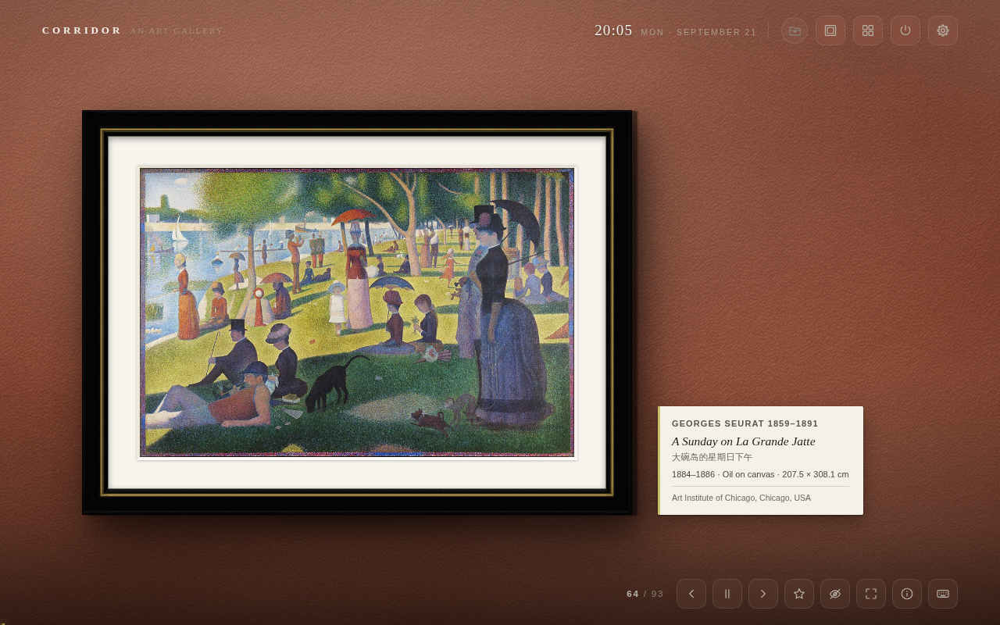
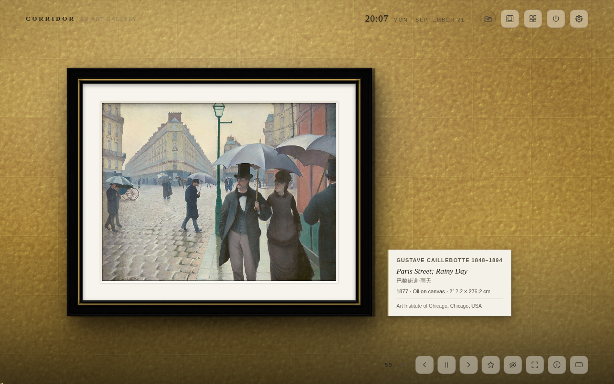
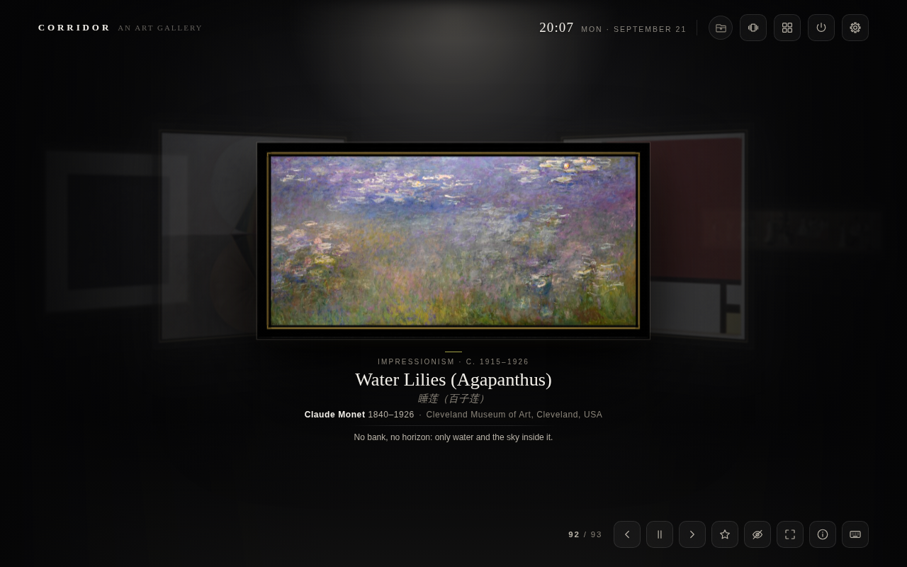
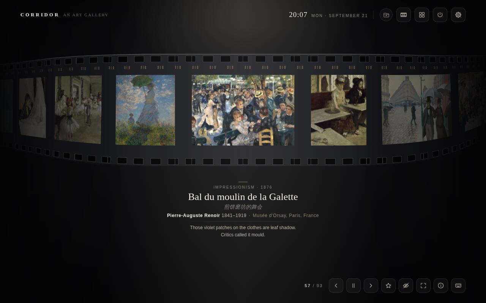
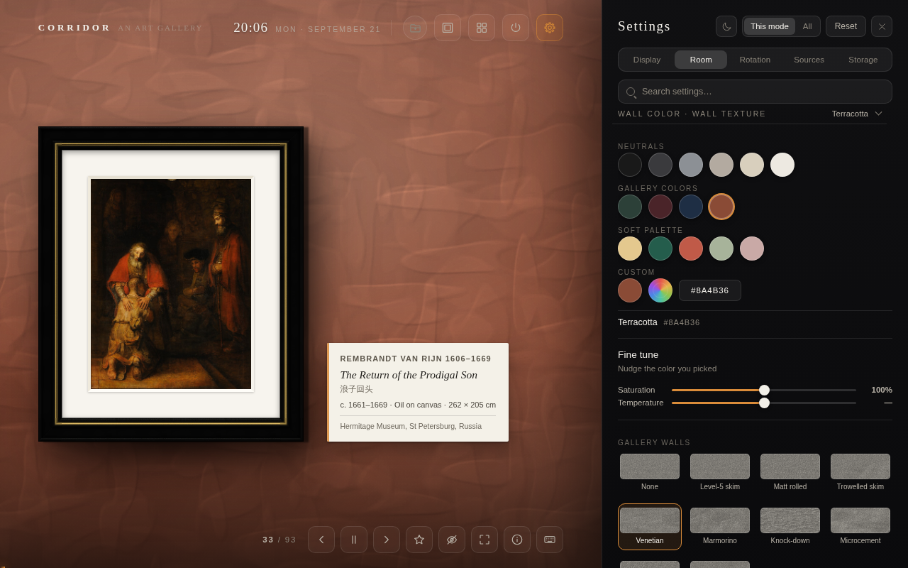
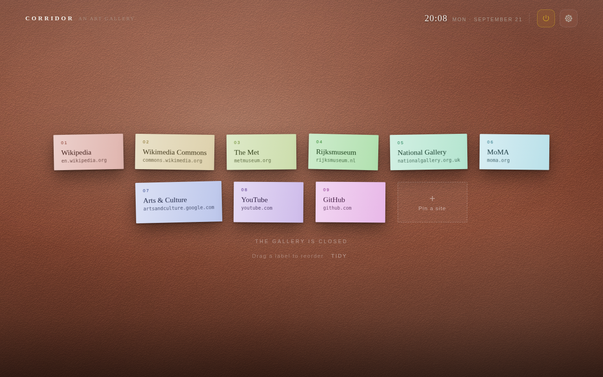
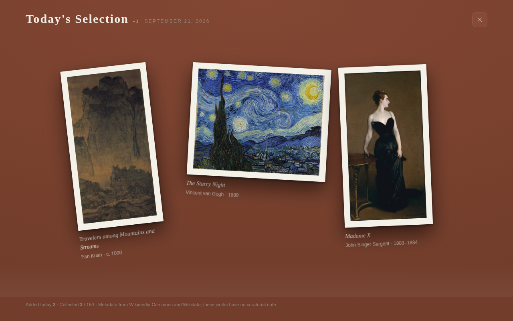

<div align="center">

# Corridor

**Open a new tab. See a work of art.**

[](LICENSE)
[](corridor-newtab/manifest.json)
[](https://www.google.com/chrome/)
[](#privacy)

One artwork, one memory.<br>
One wall color, one mood.<br>
One beam of light, one atmosphere.

**English** · [简体中文](README.zh-CN.md)

[Install](#install) · [Features](#features) · [Manual](corridor-newtab/README.md) · [Privacy](PRIVACY.md) · [Changelog](CHANGELOG.md)



</div>

---

## What it is

**Corridor** turns Chrome's new tab page into a quiet museum wall.

It comes with 106 public-domain masterpieces, from *A Thousand Li of Rivers and Mountains* to *The Starry Night*.
Discover great works, learn a little more about art, or hang your own photos and creations on the wall —
bringing familiar moments back into view.

Every work carries a curated note written for this project. Work-safe mode is on by default and keeps
the 13 works with nudity out of the rotation, so a fresh install shows 93; turn it off in settings and they all come back.

<table>
<tr>
<td width="50%"></td>
<td width="50%"></td>
</tr>
<tr>
<td width="50%"></td>
<td width="50%"></td>
</tr>
<tr>
<td width="50%"></td>
<td width="50%"></td>
</tr>
</table>

## Features

### Five viewing modes

- **Gallery Wall** — Display art as if it were hanging in a real museum
- **Immersive** — One artwork, full screen, with optional slow pan
- **Masonry** — Browse an entire wall of works at a glance
- **Circular Gallery** — Move through a curved exhibition space
- **Filmstrip** — Browse frame by frame, complete with film-edge markings and frame numbers

### A gallery you can truly shape

- 11 frame styles, modeled from real mouldings and rendered with offline lighting rather than flat textures
- 5 matting options, including linen liners for paintings, paper mats, and automatic frame-aware matching
- 15 preset wall colors, plus full custom color control with adjustable saturation and warmth
- 31 wall materials, including gallery finishes, fabric walls, digital spaces, stone, architectural surfaces, and metal panels
- Adjustable spotlights: number, brightness, direction, and color temperature; shadows and highlights respond as the light changes
- Each work's six main colors are read automatically and laid out as a swatch strip — click one to copy it; the label and buttons pick up the artwork's accent

### Curate your own exhibition

- Add local folders or online galleries and hang your own photos and artwork in Corridor: travel journals, family memories, old photos of your parents, your child's drawings, and more
- Multiple gallery sources are supported, each with its own filters for file names, formats, or regular expressions

Photos do not have to stay buried in folders. Some memories deserve to be hung on a wall.

### Bilingual exhibitions and optional AI assistance

- Tap the label to flip it: your primary language on the front, your second language on the back — like a language flashcard tucked beside the artwork. The details page can switch language on its own too
- AI assistance is optional and off by default. It supports OpenAI- and Anthropic-compatible APIs, as well as local models through Ollama and LM Studio
- AI can help complete artwork information and extend the interface and exhibition notes to any two of 78 supported languages

### Today's Selection

- Discover a few new public-domain works from Wikimedia Commons each day and let your collection keep growing; new arrivals wait in the portfolio in the top bar
- Set how many new works appear each day; with optional AI assistance, artwork details and bilingual notes can be completed automatically

### Pause Gallery

- Press `Q` to step out of the gallery for a while and return to your usual sites: pinned sites, Chrome's most visited sites, and the tabs you have open
- Three layouts — a wall of labels, a closed-gallery notice, and a directory index — with drag-and-drop organization

### Library, Remove Artwork, and backup

- **Library**: all works, favorites, history and daily additions, filtered by movement, country, subject or color, or simply searched
- **Remove Artwork**: take a work you would rather not meet again off the wall, with five seconds to undo and a way back from settings any time
- **Backup and restore**: export settings, favorites and API configuration to one `.json` file and bring them back after a reinstall or on another machine; API keys can be excluded, exported in plain text, or protected with a passphrase

### Offline and private

- No project server, no account, no analytics
- API keys are sent only to the endpoint you provide
- Settings, favorites, and cached images stay on your device; cached works remain available offline
- Images from local galleries are never copied or uploaded and are read only when displayed

**Keyboard shortcuts**　`← →` Navigate · `F` Favorite · `X` Remove · `Z` High resolution · `I` Info · `L` Library · `M` Mode · `C` Clock · `D` Download · `Q` Pause Gallery · `S` Settings · `Space` Pause · `Esc` Close

Hover the keyboard button at the bottom right to see them all.

## Install

### From the Chrome Web Store (recommended)

**[▸ Get Corridor on the Chrome Web Store](https://chromewebstore.google.com/detail/mnllopjjkbkoeljonbgmlabijamcjlam)**

Then open a new tab. Nothing else to set up.

> The interface follows your browser's language: English, or Chinese if your browser is set to Chinese.
> To change it, press `S` and go to Display → Language · Clock.

### Load unpacked (if you want to change the source)

```bash
git clone https://github.com/yearnst/corridor-newtab.git
```

1. Open `chrome://extensions/` in Chrome
2. Turn on **Developer mode** (top right)
3. Click **Load unpacked**
4. Choose the **`corridor-newtab/`** folder in the repository (the one that holds `manifest.json`)
5. Open a new tab

Edge, Brave, Arc and other Chromium browsers work too. Chrome 110 or newer.

## Project structure

```
corridor-newtab/          The extension itself (choose this folder in Load unpacked)
├── manifest.json         MV3 manifest
├── newtab.html           The new tab page
├── options.html          Options page
├── src/
│   ├── app.js            Main logic, Gallery Wall and Immersive
│   ├── modes.js          Masonry / Circular Gallery / Filmstrip
│   ├── gallery.css       All styles, including frame rendering
│   ├── store.js          IndexedDB cache and settings
│   ├── daily.js          Daily additions (Wikimedia)
│   ├── pause.js          Pause Gallery
│   ├── backup.js         Backup and restore
│   ├── ai.js             Optional model endpoint
│   ├── localnet.js       Connecting to local models (Ollama and others)
│   ├── diag.js           Endpoint error diagnosis
│   ├── translate.js      Multilingual: artwork translations and interface language packs
│   ├── local.js          Local folders and online galleries
│   ├── i18n.js           Interface strings
│   ├── langs.js          The 78-language table
│   ├── tone.js           Wall color and tone
│   ├── options.js        Options page
│   └── sw.js             Service worker
├── _locales/             Store name and summary (zh_CN / en)
├── data/catalog.json     Metadata and curated notes for the 106 works
├── assets/frames/        10 frame textures
├── assets/tex/           31 wall finish textures
├── icons/                16 / 32 / 48 / 128
├── README.md             Full manual (long; everything is in there)
└── README.zh-CN.md       Full manual in Chinese

media/                    Screenshots for the README and the project site (12 × 1280×800; the Chinese set is in media/zh-CN/)
```

## Development

No build step, no dependencies, no node_modules — edit the source, go back to `chrome://extensions/` and click reload.

To build a zip yourself (for example to upload to the store), zip the extension folder. Only what the extension
actually uses goes in; the two manuals and system junk files stay out:

```bash
cd corridor-newtab
zip -r -X ../corridor-newtab.zip . -x 'README.md' 'README.*.md' '.DS_Store' '*/.DS_Store' '._*'
```

`manifest.json` must sit at the root of the zip — don't wrap it in an extra folder.

## Privacy

No project server, no account, no analytics. Settings, favorites and the cache stay on your device,
and cached works stay viewable offline.

The extension makes only three kinds of network request, all of them optional:

1. Artwork images from `upload.wikimedia.org`
2. Metadata for daily additions from `commons.wikimedia.org` / `www.wikidata.org`
3. AI requests or online gallery pages to **the address you typed in yourself** — leave it blank and not one request is made

Any API key you enter is sent only as a request header to that address, nowhere else.
Local images in your custom library are never copied, uploaded or cached; they are read once, at the moment they are shown.

Pause Gallery reads Chrome's most-visited list and your open tabs through two optional permissions (`topSites`, `tabs`):
not requested at install, asked for only when you turn that source on, and revocable any time. It sees only site names
and addresses, which never leave your computer, and that screen fetches no site icons and makes no network requests.

Full details: **[PRIVACY.md](PRIVACY.md)**.

## Image sources and license

All artwork images are public-domain high-resolution scans from [Wikimedia Commons](https://commons.wikimedia.org);
the source and collection of each are recorded in `data/catalog.json`. These images are not covered by this repository's license.

**The curated notes were written for this project** — not copied from an encyclopedia — and are MIT licensed along with the code.

## Contributing

Issues and pull requests are welcome, especially:

- Incorrect metadata for a work (artist, date, collection)
- Public-domain works worth adding
- Display problems in a particular browser or at a particular resolution
- Translations of the interface into other languages

Please read [CONTRIBUTING.md](CONTRIBUTING.md) first. Report security issues through [SECURITY.md](SECURITY.md), not in a public issue.

## License

Code and curated notes: [MIT](LICENSE) · Artwork images: public domain

By **Charles Chern** ([@yearnst](https://github.com/yearnst)) · achillesmars@gmail.com
